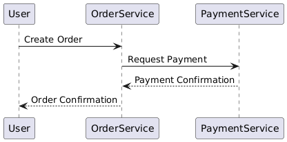

---

### **Microservices and APIs: An Overview**

#### **What are Microservice APIs?**
Microservice APIs are the programmable interfaces that allow microservices to communicate and integrate with each other. They provide a standardized way for microservices to expose their functionality, enabling seamless communication and data exchange between independently deployable services.

---

#### **What are Microservices?**

**Definition:**
- Microservices are an architectural style where a system is composed of small, independent, and autonomous services.
- Each microservice is designed to perform a specific task (adhering to the **Single Responsibility Principle**).

**Key Characteristics:**
1. **Independence:** Each microservice runs independently and can be developed, deployed, and scaled separately.
2. **Collaboration:** Microservices communicate with one another to achieve a larger business goal.
3. **Narrow Scope:** Each microservice has a well-defined and limited purpose.

**Comparison with Monolithic Applications:**
- **Monolithic Applications:** Built as a single, unified unit. All components are tightly coupled, making it harder to scale and update.
- **Microservices:** Decoupled, allowing more flexibility, scalability, and resilience.

---

#### **What is an API?**

**Definition:**
- An API (Application Programming Interface) is a set of rules and protocols for interacting with a software application programmatically.

**Types of APIs:**
1. **Programmatic Interfaces:** For interacting with applications through code (e.g., RESTful APIs, gRPC).
2. **Graphical Interfaces:** For interacting with applications through a GUI.

**What is a Web API?**
- A Web API is an API accessible over the internet using HTTP/HTTPS protocols. It allows data transfer in formats such as JSON or XML.

---

#### **How Do APIs Drive Microservice Integrations?**

- APIs act as the **interface** between microservices.
- They ensure communication is standardized, secure, and efficient.
- APIs are often documented with protocols such as **OpenAPI (formerly Swagger)** to ensure clarity for developers.

---

### **UML Diagrams**

#### **1. Entity-Relationship Diagram (ERD)**
This diagram illustrates the relationship between entities in a system, such as microservices interacting through APIs.

- **Entities:** `User`, `Order Service`, `Payment Service`
- **Relationships:** Users interact with the system, and services communicate with each other via APIs.


---

#### **2. Sequence Diagram**
This diagram shows how a user interacts with microservices via APIs to place an order and process payment.




---

#### **3. Class Diagram**
This diagram models the structure of a microservice API.


---

### **Python Example with FastAPI**

Below is a basic example of a FastAPI-based microservice that acts as an `Order Service` communicating with a `Payment Service`.

#### **Order Service (order_service.py)**
```python
from fastapi import FastAPI
from pydantic import BaseModel
import requests

app = FastAPI()

class Order(BaseModel):
    product: str
    quantity: int
    price: float

PAYMENT_SERVICE_URL = "http://localhost:8001/pay"

@app.post("/create-order/")
async def create_order(order: Order):
    total_price = order.quantity * order.price
    payment_response = requests.post(PAYMENT_SERVICE_URL, json={"amount": total_price})
    if payment_response.status_code == 200:
        return {"status": "Order placed successfully", "order": order}
    return {"status": "Payment failed"}
```

#### **Payment Service (payment_service.py)**
```python
from fastapi import FastAPI
from pydantic import BaseModel

app = FastAPI()

class Payment(BaseModel):
    amount: float

@app.post("/pay/")
async def process_payment(payment: Payment):
    if payment.amount > 0:
        return {"status": "Payment processed successfully"}
    return {"status": "Payment failed"}
```

---

### **Run and Test the Example**

1. Run both services:
   - `order_service.py` on port 8000.
   - `payment_service.py` on port 8001.
2. Test using a tool like Postman or `curl`:
   ```bash
   curl -X POST "http://localhost:8000/create-order/" -H "Content-Type: application/json" -d '{"product": "Book", "quantity": 2, "price": 15.00}'
   ```
